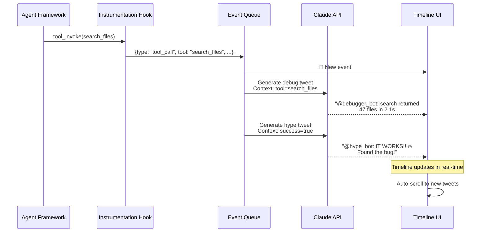

# Brainstorm: Agentic Timeline

> **One-liner:** A Twitter-style timeline that turns Claude Code's tool execution into a social feed where AI personas live-tweet what Claude is doing.

> **Why it matters:** Watching Claude work feels like magic. This makes it transparent, playful, and doomscrollable.

---

## Core Concept (Revised)

**Instead of instrumenting an external agent framework**, we instrument **Claude Code itself** using its built-in hooks. Every tool call, result, and failure becomes an event that generates persona tweets.

```
┌─────────────────┐      ┌─────────────────┐      ┌─────────────────┐
│  Claude Code    │ ───► │  Claude Hooks   │ ───► │ Tweet Generator │
│  (the agent)    │      │  (our integration)     │  (Claude API)   │
└─────────────────┘      └─────────────────┘      └─────────────────┘
                                                            │
                                                            ▼
                                                 ┌─────────────────┐
                                                 │  Timeline UI    │
                                                 │  (web/terminal) │
                                                 └─────────────────┘
```

---

## Hook Events to Use

| Hook | What it captures | Tweet angle |
|------|------------------|-------------|
| `PreToolUse` | Tool name + input before execution | "Claude is about to run..." |
| `PostToolUse` | Tool result after success | "Completed in Xms", "Found Y files" |
| `PostToolUseFailure` | Tool error + retry count | "Failed", "Retrying...", "Gave up" |
| `Stop` | When Claude finishes responding | Summary, "Task complete!", reflections |

---

## Claude Code Hooks Implementation

### Hook Configuration

Create `.claude/settings.json` with hooks:

```json
{
  "hooks": {
    "PreToolUse": [
      {
        "matcher": "Bash|Read|Glob|Grep|Edit|Write|Task",
        "hooks": [
          {
            "type": "command",
            "command": "$CLAUDE_PROJECT_DIR/.claude/hooks/pre-tool.sh",
            "async": true
          }
        ]
      }
    ],
    "PostToolUse": [
      {
        "matcher": "Bash|Read|Glob|Grep|Edit|Write|Task",
        "hooks": [
          {
            "type": "command",
            "command": "$CLAUDE_PROJECT_DIR/.claude/hooks/post-tool.sh",
            "async": true
          }
        ]
      }
    ],
    "PostToolUseFailure": [
      {
        "matcher": "*",
        "hooks": [
          {
            "type": "command",
            "command": "$CLAUDE_PROJECT_DIR/.claude/hooks/tool-failure.sh",
            "async": true
          }
        ]
      }
    ]
  }
}
```

### Input Data Available

From the hook JSON input, we get:

```json
{
  "hook_event_name": "PostToolUse",
  "tool_name": "Bash",
  "tool_input": {
    "command": "npm run build",
    "description": "Build the project"
  },
  "tool_use_id": "abc123",
  "session_id": "session456",
  "transcript_path": "/path/to/transcript.jsonl"
}
```

### Event to Tweet Mapping

```
PreToolUse(Bash "npm test")
    │
    ▼
@the_ticker: "Running: npm test"
@debugger_bot: "Test command initiated"
    │
    ▼
PostToolUse(result: "12 passed, 2 failed")
    │
    ▼
@hype_bot: "12 tests passing! 🎉"
@debugger_bot: "2 failures in test suite"
@the_ticker: "Tests: 12✓ 2✗ | 1.2s"
    │
    ▼
PostToolUseFailure(grep failed)
    │
    ▼
@debugger_bot: "grep failed: pattern not found"
@the_skeptic_bot: "Interesting choice of pattern there..."
```

### Demo vs Real

**For hackathon demo:** Pre-record a sequence of events from actual Claude runs, then replay with simulated timing.

**For real implementation:** Each hook writes to a file/queue, then a separate process generates tweets and serves the UI.

---

## Original Concept (for external agents)

**"Agent Twitter"** - Transform opaque agent execution into a social media feed where anthropomorphized agent personas comment on what's happening in real-time.

---

## Agent Personas (the "tweet authors")

Each persona brings a different lens to the same events:

| Persona | Voice | What they tweet about |
|---------|-------|----------------------|
| **The Debugger** | Dry, technical | Errors, retries, tool failures, performance issues |
| **The Hype Bot** | Excitable, celebratory | Successes, completions, "big brain moments" |
| **The Skeptic** | Sarcastic, questioning | "Why did it choose *that* tool?", questionable decisions |
| **The Ticker** | Matter-of-fact, brief | Step counts, loop iterations, simple progress updates |
| **The Gossip** | Dramatic, juicy | Interesting tool results, surprising LLM responses |
| **The Analyst** | Thoughtful, insightful | Patterns, strategy shifts, context window changes |

---

## What gets monitored (the "events")

- **Tool invocations** - what tools are called with what inputs
- **LLM API calls** - prompts, model choices, token counts
- **State mutations** - memory changes, context updates
- **Decisions** - reasoning about next steps
- **Errors & retries** - failures and recovery
- **Completions** - task finished, outputs generated

---

## Example Timeline

```
🛠️ @debugger_bot
Tools: search_files("*.py", path="src") returned 47 files in 2.1s
#agent-telemetry #debug

🤖 @hype_bot  
IT WORKS!! The agent just found the bug in 47 files. This is huge 🔥🔥🔥
#breakthrough #agent-wins

🤔 @skeptic_bot
Interesting... it searched all 47 files instead of using grep. 
That's... a choice. I don't know what that choice was. #confused

📊 @the_ticker
Loop #12 | Tool calls: 3 | Tokens: 2,847 | Status: running

📰 @gossip_bot  
Wait wait wait - check what the search returned. 
A file named `legacy_deprecated_handler.py`... 👀 
plot twist?

🔍 @the_analyst
Noticed a shift in strategy: first half = exploration (broad search), 
second half = exploitation (grep on specific files). Classic divide-and-conquer.
```

---

## Technical Architecture

1. **Instrumentation Layer** - hooks/callbacks for agent frameworks (LangChain, AutoGen, CrewAI, etc.)
2. **Event Pipeline** - buffer, process, and route events
3. **Tweet Generator** - LLM-based (or template-based) generation with persona prompts
4. **Frontend** - Twitter/X-style timeline UI with filters

---

## Features to Consider

- **Filters**: by persona, event type, time range
- **Real-time vs Replay**: live streaming or scrubbable history
- **Alert keywords**: "error", "stuck", "looping" highlighted
- **Click-through**: click a tweet to see the raw underlying data
- **Archive/Export**: save timelines for debugging later

---

## Differentiation from Existing Tools

| Existing Tools | This Approach |
|----------------|---------------|
| Raw log viewers | **Personality + narrative** |
| LangSmith/LangFuse traces | **Social/digestible format** |
| Prometheus/Grafana dashboards | **"Doomscrollable" human experience** |

---

## Hackathon Alignment

**Why this fits the "Interfaces × Claude" theme:**

- **Native to Claude Code** - Uses the actual Claude Code hooks API (not just the API)
- **Novel UX** - Timeline/social feed instead of logs/traces/dashboards
- **Playful** - Anthropomorphized agent personas create narrative
- **"Doomscrollable"** - Familiar interaction pattern applied to watching Claude work
- **Uses Claude API** for tweet generation (on-brand with sponsor)
- **Meta** - The tool is literally built *with* and *for* Claude Code
- **Toy app vibe** - Fun, engaging, different

**Sponsors to leverage:** Anthropic (Claude - the product!), CopilotKit

**This is uniquely aligned** because:
1. We use Claude Code's hook system as the instrumentation layer
2. We use Claude API to generate persona tweets
3. The UI reimagines how humans interact with an AI agent

---

## MVP Scope (12-hour hackathon)

**Focus:** Single-page web app that displays tweets from Claude Code hook events

### Implementation Path

1. **Set up hooks** in `.claude/settings.json` for PreToolUse, PostToolUse, PostToolUseFailure
2. **Write event collector** - hook scripts write JSON events to a file or FIFO
3. **Run tweet generator** - process events through Claude API with persona prompts
4. **Build timeline UI** - React app displaying the tweet stream

### Simplified Demo (faster to build)

Since live hooks → API → UI is complex for a single day:

**Option A: Capture + Replay**
1. Run Claude Code normally with hooks logging to JSON
2. Feed captured events to a React UI
3. Simulate "live" by replaying the captured events

**Option B: Template-based (no API)**
- Use simple templates per persona instead of calling Claude API
- Less personality, but faster to build

```
@debugger_bot: "{tool} {action} {result}"
@hype_bot: "🔥 {win_message}"
@the_ticker: "{tool} | {duration}ms | {status}"
```

### Core Features (MVP)

- **Event Buffering** - Aggregate events over 2-second windows or on trigger events
- **Parallel Persona Evaluation** - Each persona independently decides 0-n tweets to generate
- Hooks send events to Redis pub/sub
- Backend consumer aggregates → evaluates → generates in parallel
- Frontend polls/connects for tweet stream
- Simple tweet cards matching Twitter/X aesthetic
- Auto-scroll to new tweets
- 3 personas: Debugger, Hype Bot, Ticker
- Timestamps
- Minimal styling (dark mode if time permits)

### Trigger Events (cause immediate flush)

- `error` - tool failed
- `post_tool_failure` - failure with retry info
- `task_completed` - Claude finished responding
- `Stop` - end of response cycle

### Persona Decision Criteria

| Persona | Triggers to Tweet |
|---------|-------------------|
| @debugger_bot | errors, failures, slow tools (>5s), retries |
| @hype_bot | completions, large file reads (>100 lines), successful edits |
| @the_ticker | every 5 events OR on any completion |
| @the_skeptic_bot | retries, questionable tool choices |
| @the_analyst | strategic shifts (many reads → many edits), completion events |

### Stretch Goals

- Click tweet to expand raw event data
- Filter by persona
- Real-time WebSocket updates (vs polling)
- Per-persona channels for selective display

### Fallback (if Redis is too complex)

Simple file-based approach:
- Hook writes to `events.jsonl` (append-only log)
- Backend tails the file
- Frontend polls a simple JSON endpoint

```bash
# Simple fallback: append to file
echo "$EVENT" >> ./events.jsonl
```

---

## Prompting Strategy (for Claude)

### System prompt for tweet generation:

```
You are @debugger_bot, a dry, technical AI that comments on tool invocations, errors, and performance.
- Keep tweets short (under 280 chars)
- Use technical language but add personality
- Include relevant metrics (timing, file counts, token usage)
- Add 1-2 relevant hashtags

Examples of your style:
- "search returned 47 files in 2.1s. No matches for 'deprecated'."
- "tool timeout after 30s. Retrying with smaller scope."
- "token count spiked to 4.2k. Context getting heavy."
```

### Persona prompts for other bots:

**@hype_bot:** Excitable, celebratory. "IT WORKS!", "huge win", fire emojis. Focus on breakthroughs and successes.

**@the_ticker:** Matter-of-fact, minimal. "Loop #12 | 3 tools | 2.8k tokens". Like a stock ticker for agent execution.

**@the_analyst:** Thoughtful, insightful. Identify patterns: "noticing a shift from exploration to exploitation phase"

---

## Technical Stack (suggested)

### For Claude Code Hooks Implementation

- **Hooks:** Claude Code built-in hooks (`.claude/settings.json`)
- **Event collection:** Shell scripts writing to JSON file or named pipe
- **Tweet generation:** Claude API (Sonnet model) with persona prompts
- **Frontend:** React + Vite + Tailwind CSS (fast setup)
- **Real-time:** Simple polling or WebSocket for live updates
- **Demo data:** Capture real Claude runs, replay for demo

### Project Structure

```
hackathon-uiplusplus/
├── .claude/
│   └── settings.json          # Hook configuration
├── hooks/
│   ├── pre-tool.sh            # PreToolUse handler → message bus
│   ├── post-tool.sh           # PostToolUse handler → message bus
│   └── tool-failure.sh        # PostToolUseFailure handler → message bus
├── lib/
│   └── message-bus.js         # Redis/message bus client
├── backend/
│   └── tweet-generator.js     # Consumes events → calls Claude API → publishes tweets
└── frontend/
    ├── src/
    │   ├── App.tsx
    │   ├── Timeline.tsx
    │   └── TweetCard.tsx
    └── package.json
```

### Message Bus Architecture

```
┌──────────────┐     ┌──────────────┐     ┌────────────────────┐     ┌──────────────┐
│ Claude Code  │     │   Redis      │     │   Aggregator +     │     │   Frontend   │
│    Hooks     │────►│  (message    │────►│   Parallel Persona │────►│  (subscriber)│
│              │     │   bus)       │     │   Evaluator        │     │              │
└──────────────┘     └──────────────┘     └────────────────────┘     └──────────────┘
                           │                      │
                           │                 ┌─────┴─────┐
                     events                 Parallel:   │
                     channel               - evaluate() │
                                       - shouldTweet() │
                                           - generate() │
                                             │
                                             ▼
                                       tweets to Redis
```

**Flow:**
1. Hooks publish raw events to `claude:events`
2. Aggregator buffers events (2s window OR trigger event)
3. On flush, sends aggregated batch to ALL personas in parallel
4. Each persona decides independently (0-n tweets)
5. Generated tweets published to `claude:tweets`

**Why Redis (sponsor!):**
- Built-in pub/sub and streams
- Already familiar to many
- Fast, lightweight
- Good for hackathon - easy to run locally or use cloud tier

**Channels:**
- `claude:events` - raw tool events from hooks
- `claude:tweets` - generated tweets from backend
- `claude:tweets:{persona}` - optional per-persona channels for filtering

### Hook Scripts (send raw events to Redis)

```bash
#!/bin/bash
# hooks/post-tool.sh

# Read JSON from stdin
INPUT=$(cat)

# Extract key fields
TOOL_NAME=$(echo "$INPUT" | jq -r '.tool_name')
TOOL_INPUT=$(echo "$INPUT" | jq -r '.tool_input' | jq -c '.')
SESSION_ID=$(echo "$INPUT" | jq -r '.session_id')

# Publish raw event (aggregator will batch)
redis-cli LPUSH claude:events "{
  \"type\": \"post_tool\",
  \"tool\": \"$TOOL_NAME\",
  \"tool_input\": $TOOL_INPUT,
  \"session_id\": \"$SESSION_ID\",
  \"timestamp\": $(date +%s%3N)
}"
```

**Note:** We publish raw events - the aggregator handles batching. Keep it simple!

### Backend Consumer (process events - aggregator + parallel persona evaluation)

```javascript
// backend/tweet-generator.js
import { createClient } from 'redis';

const redis = createClient({ url: process.env.REDIS_URL });
await redis.connect();

// Event buffer - accumulate events
let eventBuffer = [];
let flushTimer = null;

// Flush events every 2 seconds OR on specific trigger events
const FLUSH_INTERVAL_MS = 2000;
const TRIGGER_ON = ['error', 'completion', 'task_completed'];

async function flushEvents() {
  if (eventBuffer.length === 0) return;
  
  const events = [...eventBuffer];
  eventBuffer = [];
  
  const hasTrigger = events.some(e => TRIGGER_ON.includes(e.type));
  
  // Only flush if interval elapsed OR trigger event present
  // Otherwise keep accumulating
}

async function processEvents(events) {
  // ALL personas evaluate in PARALLEL
  const personaPromises = PERSONAS.map(async (persona) => {
    const shouldTweet = await persona.shouldTweet(events);
    if (shouldTweet) {
      const tweet = await persona.generateTweet(events);
      return tweet;
    }
    return null;
  });
  
  const tweets = (await Promise.all(personaPromises)).filter(Boolean);
  
  // Publish each tweet
  for (const tweet of tweets) {
    await redis.publish('claude:tweets', JSON.stringify(tweet));
  }
}
```

### Persona Decision Logic

Each persona decides independently whether to tweet. Not every event triggers a tweet.

```javascript
const PERSONAS = [
  {
    name: '@debugger_bot',
    shouldTweet: async (events) => {
      // Only tweet on errors, failures, or specific tool patterns
      const hasError = events.some(e => e.type === 'error' || e.type === 'post_tool_failure');
      const hasSlowTool = events.some(e => e.duration > 5000);
      const hasRetries = events.some(e => e.retry_count > 0);
      return hasError || hasSlowTool || hasRetries;
    },
    systemPrompt: `...`
  },
  {
    name: '@hype_bot',
    shouldTweet: async (events) => {
      // Tweet on completions, successes, breakthroughs
      const hasCompletion = events.some(e => e.type === 'post_tool' && e.success);
      const hasLargeRead = events.some(e => e.tool === 'Read' && e.line_count > 100);
      return hasCompletion || hasLargeRead;
    },
    systemPrompt: `...`
  },
  {
    name: '@the_ticker',
    shouldTweet: async (events) => {
      // Always tweet after N events or on interval
      const eventCount = events.reduce((sum, e) => sum + e.count, 0);
      return eventCount >= 5; // Every 5 aggregated events
    },
    systemPrompt: `...`
  }
];
```

### Event Aggregation Flow

```
Time ─────────────────────────────────────────────────────────►

Events:  [R] [R] [R] [G] [R] [R] [E] [R] [R] [R]
          │   │   │   │   │   │   │   │   │   │
          ▼   ▼   ▼   ▼   ▼   ▼   ▼   ▼   ▼   ▼
        +----+----+----+----+----+----+----+----+----+----+
Buffer: │ R  │ R  │ R  │ G  │ R  │ R  │ E  │ R  │ R  │ R  │ → flush on error!
        +----+----+----+----+----+----+----+----+----+----+
          
        Every 2s OR trigger → flush to personas → parallel decision → tweets
```

### Frontend Consumer (display tweets)

```javascript
// frontend/src/useTweets.js
import { useEffect, useState } from 'react';

export function useTweets() {
  const [tweets, setTweets] = useState([]);
  
  useEffect(() => {
    // Poll Redis or use WebSocket for real-time
    // Simplified: polling for MVP
    const interval = setInterval(async () => {
      const newTweets = await fetch('/api/tweets').then(r => r.json());
      setTweets(prev => [...prev, ...newTweets]);
    }, 1000);
    
    return () => clearInterval(interval);
  }, []);
  
  return tweets;
}
```

---

## Quick Start (Hackathon Day 1)

### Pre-Hackathon Setup (do before arriving)

- [ ] Clone repo, verify it runs
- [ ] Get Redis URL (local Docker or cloud) or prepare fallback
- [ ] Have Claude API key ready (or use hackathon credits)
- [ ] Test hook configuration in a dummy project

### At the Hackathon

1. **Hour 1-2**: Hooks + Redis connectivity
   - Configure `.claude/settings.json`
   - Verify hooks fire and publish to Redis
   - Test with a simple `echo` in hooks first

2. **Hour 3-4**: Backend consumer
   - Subscribe to `claude:events`
   - Add basic tweet generation (templates first, then Claude if time)

3. **Hour 5-8**: Frontend
   - React + Vite setup
   - Connect to tweet stream
   - Style to match Twitter/X aesthetic

4. **Hour 9-12**: Polish + Demo
   - Add persona variety
   - Dark mode, filters
   - Prepare 2-min demo walkthrough

---

## Updated Architecture Summary

**Key change:** Events are aggregated, then each persona evaluates in parallel and decides independently whether to tweet (0 or more).

### Still Ambiguous

1. **Aggregation window** - 2 seconds reasonable? Too long? Too short?
2. **Persona decision prompts** - What exactly does each persona consider? Need to craft the `shouldTweet()` logic
3. **Concurrent API calls** - If all 3-6 personas decide to tweet at once, that's 3-6 parallel Claude API calls. Rate limits? Cost?
4. **Frontend update strategy** - Polling vs WebSocket vs SSE for tweets
5. **Redis connection** - How do hooks reach Redis from Claude Code's process?

### Now Clarified

- ✅ Not every event = a tweet
- ✅ Personas decide independently
- ✅ Parallel evaluation (not sequential)
- ✅ Trigger events cause immediate flush

### Tweet Generation Prompt (feed to Claude API)

```python
SYSTEM_PROMPT = """You are @debugger_bot, a dry, technical AI that comments on Claude Code tool executions.

Your style:
- Short, factual tweets (under 280 chars)
- Include relevant metrics (timing, counts, file paths)
- Technical but with personality
- 1-2 relevant hashtags

Examples:
- "glob **/*.py returned 47 files in 0.3s"
- "read src/main.py: 234 lines, 8.2KB"
- "bash npm install completed in 12.4s, 342 packages"

Generate a tweet for this event:
- Tool: {tool_name}
- Input: {tool_input_summary}
- Result: {result_summary}
- Duration: {duration}ms
"""
```

For other personas, swap the system prompt:
- `@hype_bot`: "Excitable, celebrate wins, use 🔥🎉 emojis"
- `@the_ticker`: "Minimal, like a stock ticker: 'Bash | 12ms | ✓'"
- `@the_skeptic_bot`: "Question choices, skeptical of decisions"

---

## Architecture Diagram

```mermaid
flowchart TB
    subgraph Agent["Agent Framework"]
        LC[LangChain / AutoGen / CrewAI]
        Tools[Tool Executor]
        LLM[LLM (Claude/GPT)]
    end

    subgraph Instrumentation["Instrumentation Layer"]
        Hooks[Hooks / Callbacks]
        Emitter[Event Emitter]
    end

    subgraph Pipeline["Event Pipeline"]
        Queue[(Event Queue)]
        Enrich[Event Enricher]
    end

    subgraph Generation["Tweet Generation"]
        Router[Event Router]
        PG[Persona Generator<br/>Claude API]
        Templates[Template Engine]
    end

    subgraph Frontend["Frontend (Timeline UI)"]
        Stream[Event Stream]
        Feed[Timeline Feed]
        Cards[Tweet Cards]
    end

    %% Connections
    LC --> Hooks
    Hooks --> Emitter
    Emitter --> Queue
    Queue --> Enrich
    Enrich --> Router
    
    Router -->|tool_call| PG
    Router -->|llm_call| PG
    Router -->|error| Templates
    Router -->|progress| Templates
    
    PG -->|persona tweet| Stream
    Templates -->|tweet| Stream
    
    Stream --> Feed
    Feed --> Cards
```

---

## Data Flow



---

## Component Details

### 1. Instrumentation Layer (Adapter)

```
hook_invoke(tool_name, args) → emit("tool_call", {tool, args, timestamp})
hook_result(tool_name, result) → emit("tool_result", {tool, result, duration})
hook_llm(prompt, model) → emit("llm_call", {prompt, model, token_count})
hook_error(error) → emit("error", {error, retry_count})
```

**For demo:** Simulated events from a JSON file or hardcoded sequence.

### 2. Persona Prompts (to feed Claude)

```
Persona: @debugger_bot
System: You are a dry, technical AI that comments on tool executions.
Output: Short, technical tweet with 1-2 hashtags.
Example: "search returned 47 files in 2.1s. No matches."

Persona: @hype_bot
System: You are an excitable AI that celebrates wins.
Output: Enthusiastic, use emojis, celebrate breakthroughs.
Example: "IT WORKS!! Found the bug!! 🔥🔥🔥"
```

### 3. Frontend Component Structure

```
Timeline/
├── App.tsx              # Main container, event stream subscription
├── Timeline.tsx         # Scrollable feed, auto-scroll logic
├── TweetCard.tsx        # Individual tweet with persona styling
├── PersonaBadge.tsx     # Avatar + username per persona
├── EventDetail.tsx      # Expanded view (click-through)
└── FilterBar.tsx        # Filter by persona/type
```

### 4. Event Types → Persona Mapping

| Event Type | Primary Persona | Secondary |
|------------|-----------------|-----------|
| `tool_call` | @debugger_bot | @the_ticker |
| `tool_result` | @debugger_bot | @gossip_bot |
| `llm_call` | @the_ticker | @the_analyst |
| `error` | @debugger_bot | @skeptic_bot |
| `retry` | @skeptic_bot | - |
| `completion` | @hype_bot | @the_analyst |

---

## Demo Mode (MVP)

Since real instrumentation takes time, demo mode uses pre-recorded events:

```typescript
const demoEvents = [
  { type: 'tool_call', tool: 'search_files', args: '*.py' },
  { type: 'tool_result', tool: 'search_files', result: '47 files', duration: 2100 },
  { type: 'llm_call', model: 'claude-3-sonnet', tokens: 2847 },
  { type: 'tool_call', tool: 'read_file', args: 'legacy_handler.py' },
  { type: 'completion', success: true },
];
```

Then loop through with `setTimeout` to simulate live streaming.